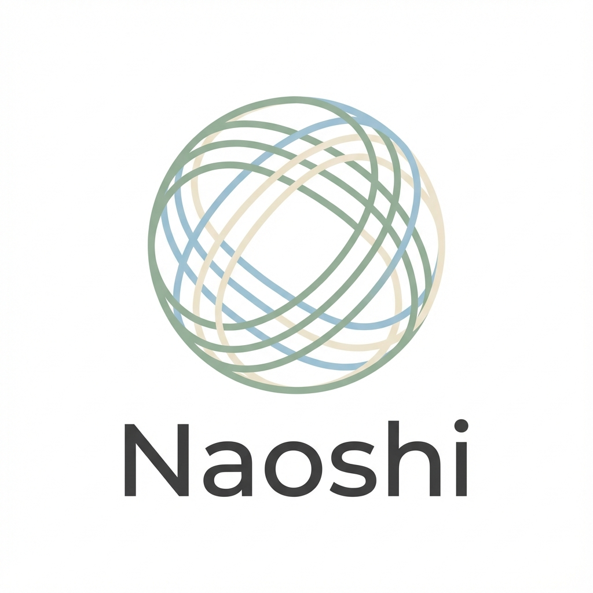

# Naoshi - Precision STL Repair Studio



**Naoshi** (直し - Japanese for "repair/fix") is a powerful, local-first 3D mesh repair and editing studio designed for makers and 3D printing enthusiasts. It specializes in fixing broken STL/OBJ files—especially those generated by AI tools like Rodin or Meshy—making them watertight and 3D printable.

## ✨ Key Features

- **Deep Mesh Repair**: Automatically fixes non-manifold geometry, holes, and flipped normals using advanced algorithms (Alpha Wrap, Poisson Reconstruction).
- **Anime-Style Repair Visualization**: Watch your model transform with beautiful "Spirit Restoration" effects during repair.
- **CAD-Style Editing**: Move, rotate, and scale models with a familiar Gizmo.
- **Sketch & Extrude**: Draw 2D shapes on a plane and extrude them into solid 3D volumes (perfect for creating bases or stands).
- **Smart Validation**: Instantly checks if your model is "Watertight" and print-ready upon loading.
- **100% Local**: All processing happens securely on your machine. No cloud uploads needed.

---

## 🚀 Quick Start (Windows)

The easiest way to get started is using the **One-Line Installer**.

### Option 1: PowerShell Command (Recommended)
Open PowerShell and run:
```powershell
powershell -c "irm https://raw.githubusercontent.com/aaravsaianugula/Naoshi/main/install.ps1 | iex"
```
This will automatically download, install (to `%LOCALAPPDATA%`), and create a Desktop shortcut.

### Option 2: Manual Install
1. Download the ZIP from GitHub and extract it.
2. Run `install.bat`.
3. Open the **Naoshi** shortcut on your Desktop.

---

## 🛠️ Requirements

- **OS**: Windows 10 or 11
- **Python**: Version 3.10 or higher ([Download Here](https://www.python.org/downloads/))
- **Node.js**: Version 18+ for frontend ([Download Here](https://nodejs.org/))
- **Browser**: Chrome, Edge, or Firefox

---

## 🎨 Features & Usage

### 1. Repairing Models
1. Drag & drop your broken `.stl` or `.obj` file into the window.
2. The app will automatically analyze it. If it says **"Not Watertight"**, click **Repair Model**.
3. Watch the progress with the anime-style "Spirit Restoration" effect:
   - The model transforms from sketch to fully rendered as it repairs
   - Camera slowly orbits for a cinematic view
   - Progress sweeps from bottom to top
4. When complete, click **Download Fixed** to save your repaired model.

### 2. Editing & Extrusion
- **Transform**: Use the toolbar icons for Move, Rotate, and Scale.
- **Extrude**: 
  1. Switch to **Face Selection** mode.
  2. Click faces on your mesh.
  3. Click **Thicken/Extrude** to create new geometry.

---

## 🤝 For Developers

Want to contribute? 

1. Clone the repo: `git clone https://github.com/aaravsaianugula/Naoshi.git`
2. Install Python dependencies: `pip install -r requirements.txt`
3. Install web dependencies: `cd web && npm install`
4. Run the backend: `python api_server.py`
5. Run the frontend: `cd web && npm run dev`
6. Open `http://localhost:8000`

### Tech Stack
- **Backend**: Python (FastAPI, Trimesh, PyMeshLab, CGAL)
- **Frontend**: Vanilla JS, Three.js, GSAP
- **Shaders**: Custom GLSL Toon Shader with progress animation
- **Style**: Precision design system with Zinc palette

---

## 📄 License
This project is open-source under the MIT License. Feel free to modify and distribute.
